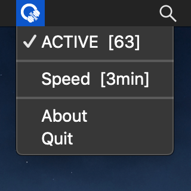
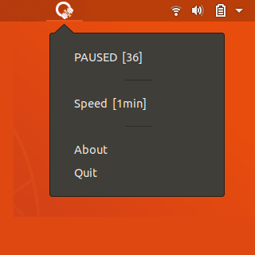
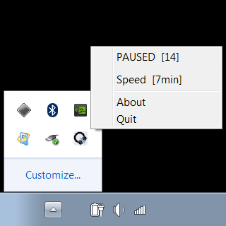

# Quiet Audio Fade

> *It's [f.lux](https://justgetflux.com) for your ears!*

---

Quiet Audio Fade (affectionately known as **Quiet AF**) slowly reduces the volume on your computer over time, letting you find the quietest level that works.

Get the latest version on the [releases page](https://github.com/StuffJackMakes/Quiet-Audio-Fade/releases/tag/v1.0).

---

## Usage
*Quiet AF* runs in the system tray like so:

Over time it *slowly* decreases your system volume bit by bit. Eventually you'll notice the sound is a tad too low and you'll increase the volume, which will disable *Quiet AF* and leave your volume at the perfect level - not too loud, not too quiet!

There are **FOUR** things you can do in the app:
* <ACTIVE | PAUSED> [Volume] - Displays if *Quiet AF* is currently enabled and what the current volume is. Click to enable/disable *Quiet AF*. *Quiet AF* is also disabled whenever you change the volume manually.
* Speed [Interval] - How much time passes between each decrease in volume. Higher intervals mean a longer, more subtle decrease. Click to cycle through interval lengths.
* About - Links to this page.
* Quit - Exits *Quiet AF*.

---

## Building
The particularities of building on any system are driven by the dependency on [systray](https://github.com/getlantern/systray). Follow the steps there to build successfully. Note that you may need to switch `media/icon_mono.png` to another image, as different operating systems have different requirements for such images.

---

## Libraries Used
* [systray](https://github.com/getlantern/systray) for using the system tray.
* [volume-go](https://github.com/itchyny/volume-go) for getting and setting the volume.
* [browser](https://github.com/pkg/browser) for directing users here.

---

## Author
Check out my other work at [stuffjackmakes.com](https://stuffjackmakes.com)
